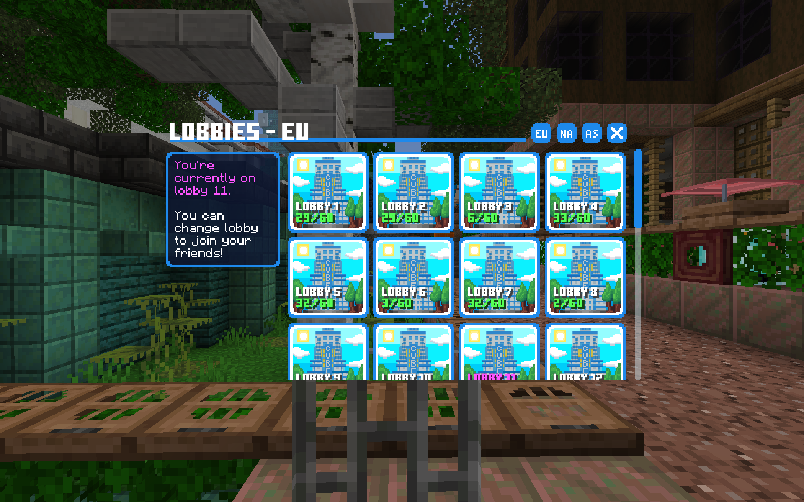
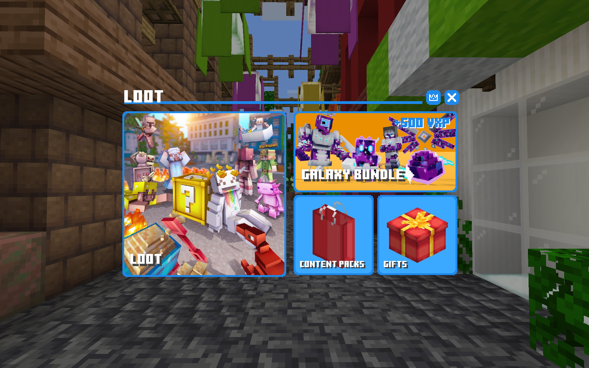
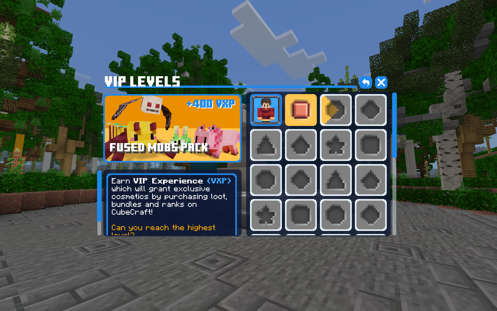

# Forms

# TAKE NOTE
> [!important]
> In the form itself, values are written without triangular and square brackets; they are there only to indicate that there should be text here, and to separate it from the other for clarity.   
>
> **If you are using: `is_dynamic&side_text<title text>`, you should write it down like this: `is_dynamic&side_textTitle text`**

# CubeCraft Navigator

# CubeCraft Navigator

### Fields:
Title: `is_dynamic&side_text<title text>`  
Square buttons: `grid_tile<button name>`

[Form Json Data](../data/cubecraft_navigator.json)

# Lobbies

### Fields:
Title: `is_dynamic&side_text<title text>`  
Square buttons: `grid_tile<button name>`    
Header buttons: `header_button<button name>`  

### Requires:
`Any content in the form`

[Form Json Data](../data/cubecraft_lobbies.json)

# Loot

### Fields:
Title: `is_dynamic&big_button&stack_text<title text>`   
Big button: `big_button<button name>`   
Rectangular button: `§t§rbig_button§g§r<button name>`   
Square button: `grid_tile<button name>`  
Header buttons: `header_button<button name>`  

### Requires:
`3 empty buttons after the big button`  
(Here they perform the role of spaces and line breaks.
Depending on the number of buttons and their type, the number of empty buttons may vary.)

[Form Json Data](../data/cubecraft_loot.json)

# Loot Search

### Fields:
Title: `is_dynamic&small_grid&stack_text&search_bar<title text>`   
Square buttons: `§s§rgrid_tile§g§r<button name>`    
Text buttons: `just_text_button<button name>`   
Header buttons: `header_button<button name>`  

[Form Json Data](../data/cubecraft_loot_search.json)

# VIP Levels

### Fields:
Title: `is_dynamic&small_grid&big_button&stack_text<title text>`   
Rectangular buttons: `§t§rbig_button§g§r<button name>`     
Square buttons: `§s§rgrid_tile§g§r<button name>`     
Header buttons: `header_button<button name>`  

### Requires:
`Any content in the form`

[Form Json Data](../data/cubecraft_vip_levels.json)

# Additional parameters for small_grid forms:
- `search_bar` - Added a search box
- `big_button` - Кнопки будут увеличены
- `grid_text` - Content will be positioned above the grid of buttons
- `stack_text` - Content will be positioned above the rectangular buttons
- `side_text` - Content will be positioned above the rectangular buttons (minimized)   

Как использовать: `is_dynamic&small_grid[parameters]<title text>` (title)   

(All parameters can be combined and are specified with `&`)

# Additional parameters for buttons
`§s§r` - The text will be displayed only when the cursor is over the button    
`§t§r` - Makes a big button rectangular    
`§w§r` - Button will change color to white   
`§g§r` - Button will change color to gold 
How to use: `button_parameter<additional_parameter[text]>`