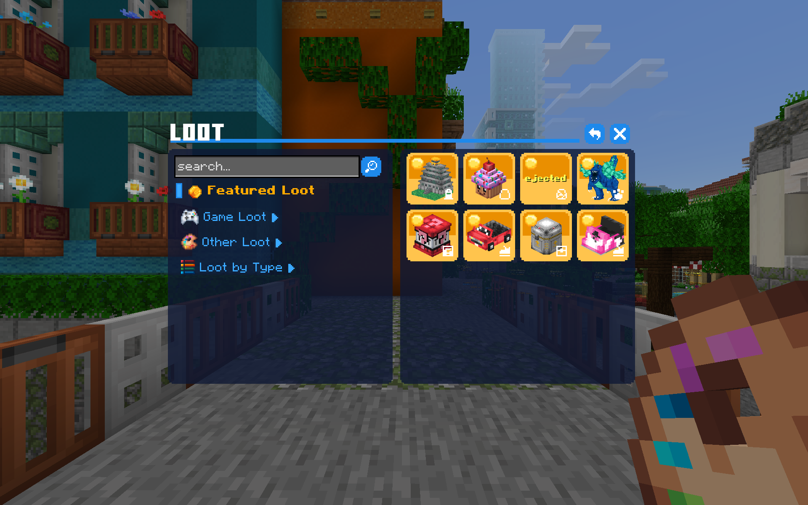

# Формы

# ОБРАТИТЕ ВНИМАНИЕ
> [!important]
> В самой форме значения пишутся без треугольных и квадратных скобок, они здесь только для того, чтобы указать, что здесь должен быть текст, и отделить его от другого для наглядности.   
>
> **Eсли вы используете: `is_dynamic&side_text<текст заголовка>`, вы должны записать это так: `is_dynamic&side_textТекст заголовка`**

# CubeCraft Navigator

### Поля:
Заголовок: `is_dynamic&side_text<текст заголовка>`  
Кнопки: `grid_tile<название кнопки>`

[Json Data формы](../data/cubecraft_navigator.json)

# Lobbies

### Поля:
Заголовок: `is_dynamic&side_text<текст заголовка>`  
Кнопки: `grid_tile<название кнопки>`    
Кнопки заголовка: `header_button<название кнопки>`  

### Требуется:
`Любой контент в форме`

[Json Data формы](../data/cubecraft_lobbies.json)

# Loot

### Поля:
Заголовок: `is_dynamic&big_button&stack_text<текст заголовка>`  
Большая кнопка: `big_button<название кнопки>`   
Прямоугольная кнопка: `§t§rbig_button§g§r<название кнопки>` 
Квадратная кнопка: `grid_tile<название кнопки>`  
Кнопки заголовка: `header_button<название кнопки>`  

### Требуется:
`3 пустых кнопки после большой кнопки`  
(Здесь они выполняют роль пробелов и переносов строк.
В зависимости от количества кнопок и их типа количество пустых кнопок может меняться.)

[Json Data формы](../data/cubecraft_loot.json)

# Loot Search

### Поля:
Заголовок: `is_dynamic&small_grid&stack_text&search_bar<текст заголовка>`   
Квадратные кнопки: `§s§rgrid_tile§g§r<название кнопки>` 
Текстовые кнопки: `just_text_button<название кнопки>`   
Кнопки заголовка: `header_button<название кнопки>`  

[Json Data формы](../data/cubecraft_loot_search.json)

# VIP Levels

### Поля:
Заголовок: `is_dynamic&small_grid&big_button&stack_text<текст заголовка>`   
Прямоугольная кнопки: `§t§rbig_button§g§r<название кнопки>`     
Квадратные кнопки: `§s§rgrid_tile§g§r<название кнопки>`     
Кнопки заголовка: `header_button<название кнопки>`  

### Требуется:
`Любой контент в форме`

[Json Data формы](../data/cubecraft_vip_levels.json)

# Дополнительные параметры для small_grid форм:
- `search_bar` - Добавляет поле поиска
- `big_button` - Кнопки будут увеличены
- `grid_text` - Контент будет расположен над сеткой кнопок
- `stack_text` - Контент будет расположен над прямоугольными кнопками
- `side_text` - Контент будет расположен над прямоугольными кнопками (уменьшен)   

Как использовать: `is_dynamic&small_grid[параметры]<текст заголовка>` (заголовок)   

(Все параметры могут комбинироваться и указываются через `&`)

# Дополнительные параметры для кнопок
`§s§r` - Текст будет отображаться только при наведении курсора на кнопку    
`§t§r` - Сделает прямоугольную кнопку больше    
`§w§r` - Кнопка изменит цвет на белый   
`§g§r` - Кнопка изменит цвет на золотой 

Как использовать: `параметр_кнопки<дополнительный_параметр[текст]>`